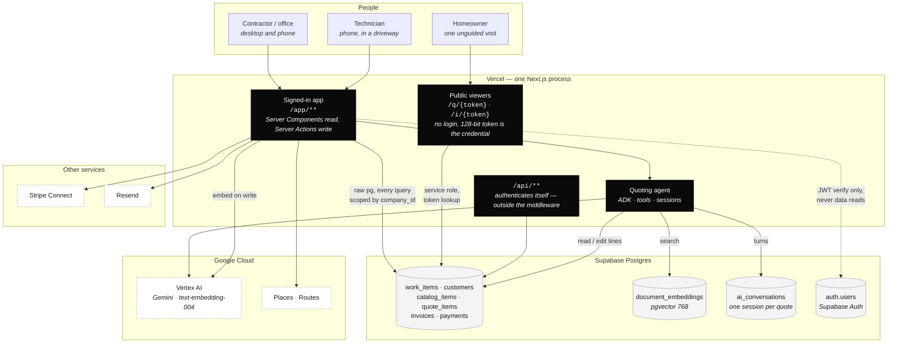
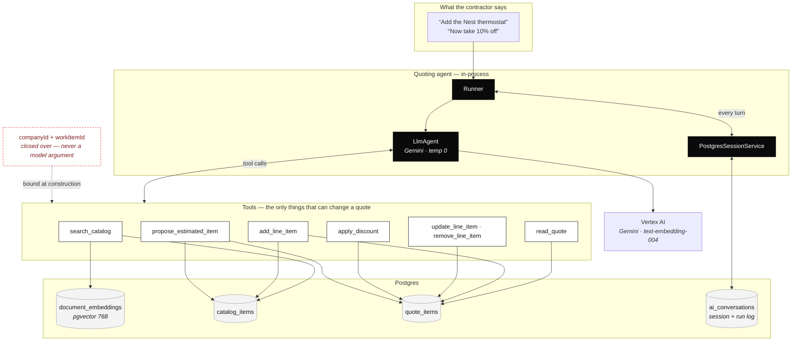
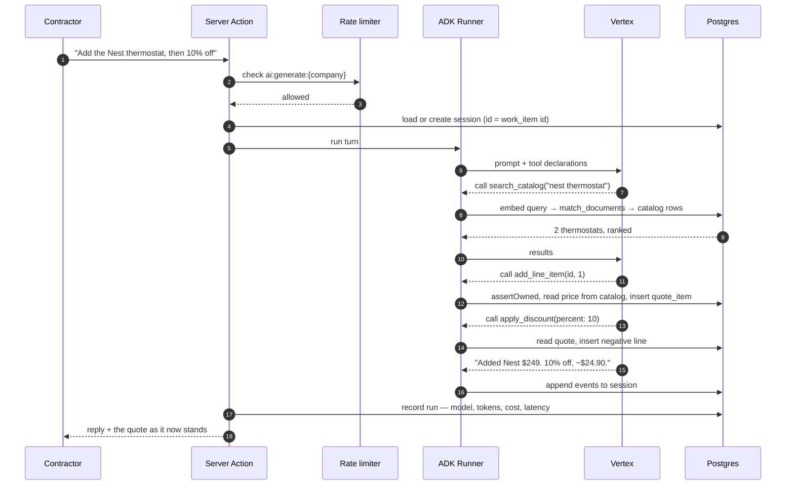
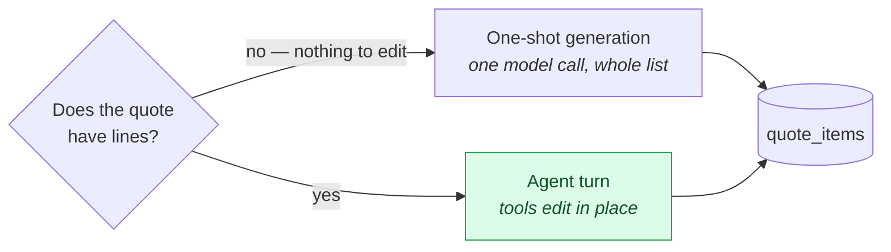
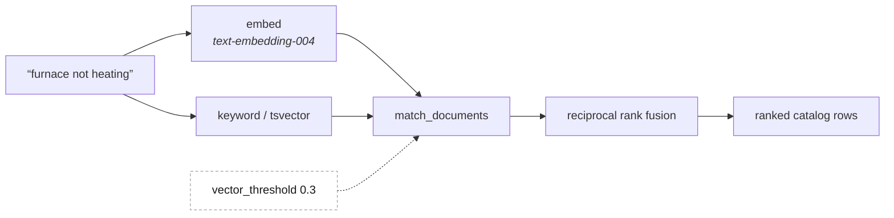
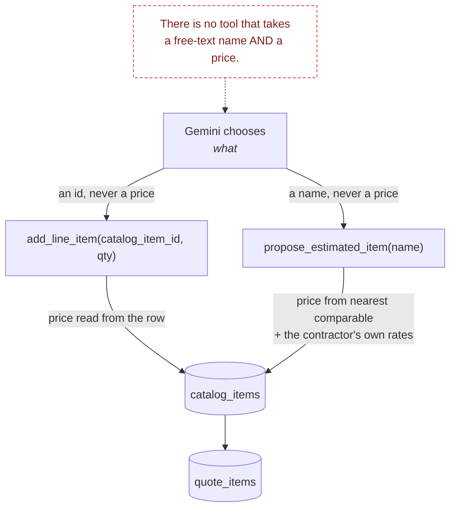
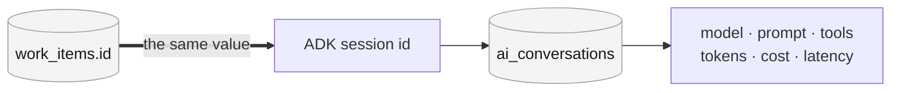

# Rivet — architecture

Date: 2026-08-16

One Next.js process runs the whole product. There is no second service, no worker, and no queue.
Everything below happens inside it or in Postgres.

---

## The system



**Two things this drawing is making a point about.** Auth is a dashed line because Supabase
verifies the JWT and nothing else — every read of company data goes through raw `pg`. And the
`pg` pool connects as superuser and **bypasses RLS**, so the `company_id` predicate on every
statement is the first line of defence, not the second. A static scanner in `tests/tenancy.test.ts`
fails the build on a statement that lacks one.

---

## The AI, end to end

Everything below runs inside the same Next.js process. ADK is a library here, not a service —
`@google/adk` is TypeScript, so there is no second runtime and no deploy target beyond the one
that already exists.



**The dashed box is the security boundary.** Company and quote are closed over when the agent is
built. The model decides *what* to do; it has no argument that could change *whose* data it does
it to.

---

## One turn, in order



Step 15 is why the editor takes the returned quote wholesale rather than replaying the agent's
edits: the tools wrote to Postgres directly, so React state is stale the moment the action
returns.

---

## Two paths, and why



A blank quote has nothing to edit, so the first draft is a *generation* — cheaper and simpler
than an agent loop for "give me a starting point". Everything after is an *edit*, because
regenerating throws away every price the contractor adjusted by hand.

The condition is **lines**, not whether the quote was saved. Gating on the saved id looked
equivalent and was not: nothing is saved until Save is pressed, which is *after* all the
iterating, so every follow-up instruction still regenerated.

---

## Retrieval



`match_documents` takes `match_company_id` as a **required** argument, so tenancy is enforced
inside the search rather than remembered around it.

The threshold is measured, not guessed. At the RPC's default of `0.6` the two queries most like
how a contractor actually talks returned **nothing**:

| Query | Top matches | At 0.6 |
| --- | --- | --- |
| "furnace not heating" | both furnaces at **0.559**, **0.540** | dropped |
| "wifi controls" | both Wi-Fi thermostats at **0.495**, **0.493** | dropped |
| "thermostat" | both thermostats at 0.664, 0.624 | kept |

The ranking was right every time; the cutoff was discarding the answer. It runs at 0.3, because
this feeds a model choosing from a shortlist — recall matters more than precision, and a
humidifier the model ignores costs a few tokens where a missing furnace costs the job.

---

## What stops a made-up price



A hallucinated price the customer accepts is a contract the contractor has to honour. So the
mechanism is removed rather than instructed against: **no tool accepts both a name and a price.**

`propose_estimated_item` is the one line without a catalog row behind it, and it is fenced. The
model supplies only the name; the price comes from the contractor's nearest comparable item and
their own markup — never a web lookup, because a retail listing carries no labour, markup or
overhead and would under-quote systematically. It refuses rather than guessing when nothing is
close enough to reason from.

The resulting line is flagged `is_estimate`, and **that flag is internal**. The customer sees a
firm price at whatever the salesperson settled on. Both public paths select explicit columns, and
a test fails if anyone adds the column or reaches for `select('*')`.

One thing the tools taught that the prompt could not: asked for "$19 discount", free-text
generation kept writing "10% discount". `apply_discount` takes `percent` **or** `amount` as
separate parameters, so the model has to choose — the signature enforcing what prose could not.

---

## Sessions and traceability



**The session id *is* the work item id.** A quote belongs to exactly one customer, so
"customer + quote" and "quote" name the same conversation — and the work item is the id the URL,
the pipeline and the invoice already key off. A separate session identifier would mean a mapping
table and a way for the two to disagree.

Every run is recorded whether it came from the agent or the one-shot path, so a quote can answer
what the AI did on it:

```
gemini:gemini-2.5-flash-lite  success
1577 in / 190 out   $0.000234   1888ms
prompt: Furnace is short cycling, replace the blower motor
```

A `mock` run — the keyword fallback, when Vertex is unreachable — records as **degraded** rather
than success. Silently shipping keyword-matched quotes to real customers looks like poor quality
instead of an outage, which is the failure nobody reports.

---

## Everything degrades rather than failing

| Missing | What happens |
| --- | --- |
| `GEMINI_API_KEY` / Vertex credentials | keyword match over the catalog, `mode: mock`, recorded as degraded |
| Embeddings unavailable | search falls back to trigram keyword |
| Index empty | same — keyword still answers |
| Rate limiter unavailable | fails **open**; quoting keeps working |
| Nothing comparable to estimate from | refuses, and says so |

The one thing that never happens is a made-up number presented as a real one.

## What runs where

| Concern | Where | Note |
| --- | --- | --- |
| Reads | Server Components → `query()` | raw `pg`, parameterised, `company_id` on every statement |
| Writes | Server Actions in `actions.ts` | Zod in, `{ ok, data } \| { ok, error }` out — never throws to the client |
| Agent | in-process, `@google/adk` | TypeScript; no Python and no second service |
| Sessions | `ai_conversations` | ADK's `BaseSessionService` implemented over raw `pg`, not its MikroORM one |
| Embeddings | Vertex `text-embedding-004` | 768 dims, fixed by the column that predates it |
| Auth | Supabase | JWT verification only |
| Public links | `work_items.public_token` | 128-bit hex, never the UUID |

## Costs that shape the design

| | measured |
| --- | --- |
| One AI quote draft | $0.00035 |
| All variable cost per customer / month | ~$0.24 |
| Fixed infrastructure | ~$111 / month |
| Gross margin at $249 | 96.9% |

The AI is three hundredths of one percent of the subscription, so model choice is a latency and
quality decision rather than a cost one. What *is* worth caching is anything billed per call with
a stable answer — drive times between two addresses, which is why `travel_estimates` exists and
is shared across companies. A distance belongs to nobody.
