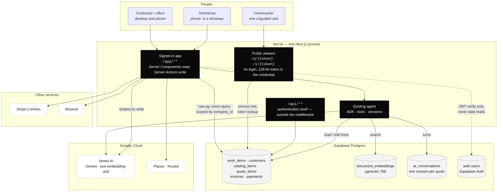
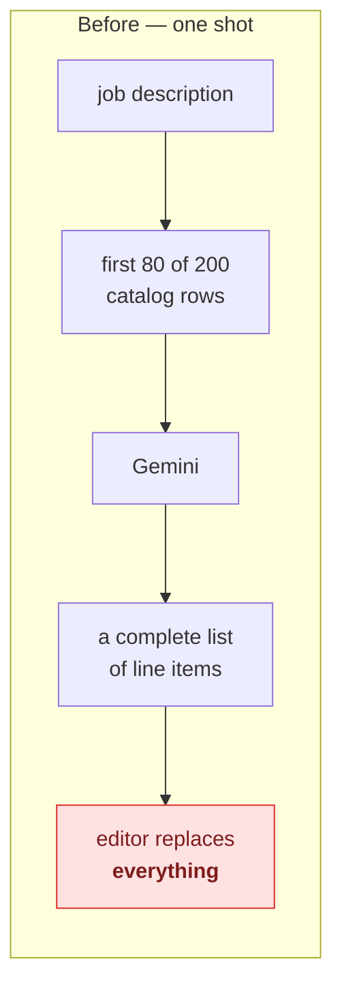
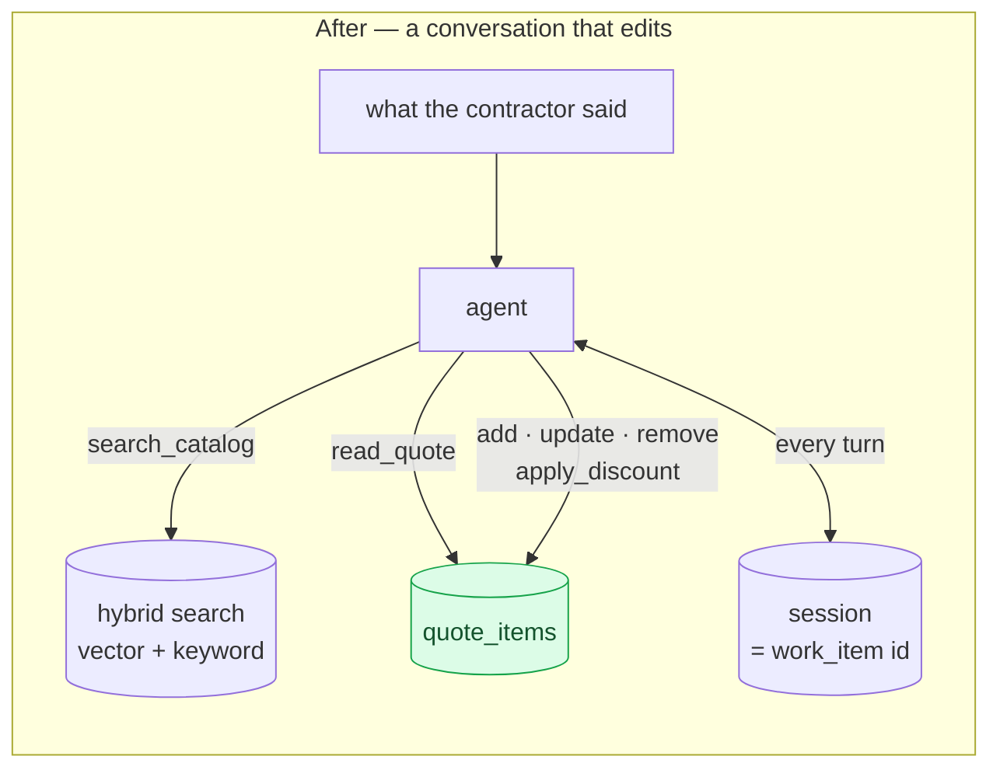
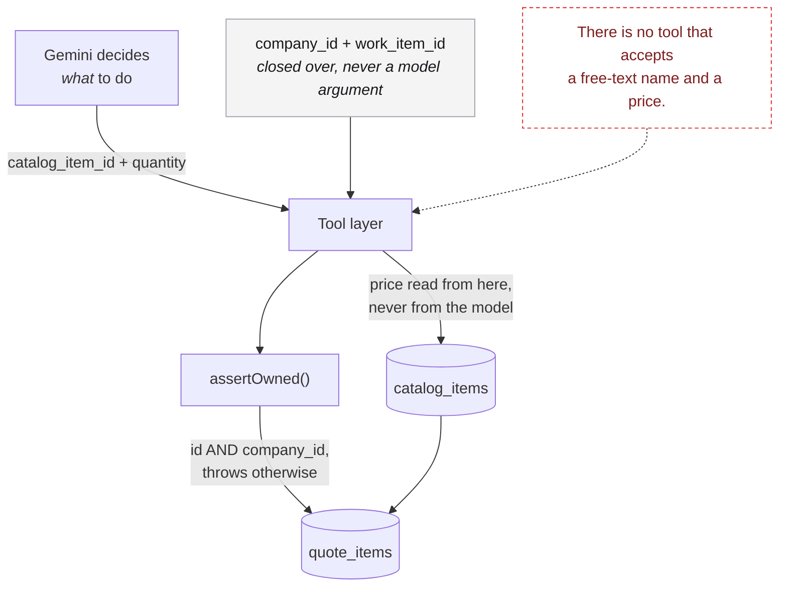
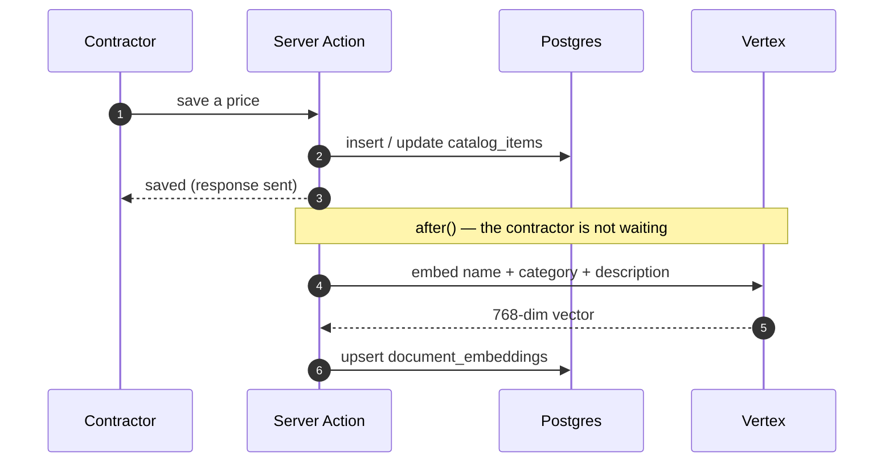

# Rivet — architecture

Date: 2026-08-16

One Next.js process runs the whole product. There is no second service, no worker, and no queue.
Everything below happens inside it or in Postgres.

---

## The system

**Two things this drawing is making a point about.** Auth is a dashed line because Supabase
verifies the JWT and nothing else — every read of company data goes through raw `pg`. And the
`pg` pool connects as superuser and **bypasses RLS**, so the `company_id` predicate on every
statement is the first line of defence, not the second. A static scanner in `tests/tenancy.test.ts`
fails the build on a statement that lacks one.

---

## Quoting, before and after

The change is not that the AI got better. It is that there is no longer a step that throws the
contractor's work away.

Worked example, run end to end against real rows:

| The contractor says | Tools that ran | Result |
| --- | --- | --- |
| "Add the Nest thermostat." | `search_catalog` → `add_line_item` | $249.00 |
| "Now take 10% off." | `apply_discount` | −$24.90 · **$224.10** |
| "What is on the quote?" | `read_quote` | reads back both lines |

The second row is the one that was impossible. Nothing regenerated, so the first line — including
any price the contractor had adjusted by hand — is untouched.

---

## Why the agent cannot invent a price

A hallucinated price the customer accepts is a contract the contractor has to honour. Rather than
instructing the model not to invent one, the tool that would let it does not exist — every line
names a `catalog_item_id` that must resolve for that company, and the price is read from that
row. The model chooses *what*; it never chooses *whose*.

---

## How a catalog item becomes searchable

Indexing lives on the write path rather than in a nightly job. An index that drifts answers
confidently with last week's prices, and nobody notices until a customer accepts one.

Retrieval goes through `match_documents`, which fuses vector and full-text results with
reciprocal rank fusion and takes `match_company_id` as a **required** argument — tenancy is
enforced inside the search rather than remembered around it.

One measured detail worth keeping: the RPC's default similarity threshold of `0.6` returned
**nothing** for "furnace not heating" (the furnaces scored 0.559) and "wifi controls" (0.495).
The ranking was right every time; the cutoff was discarding it. It runs at 0.3, because this
feeds a model choosing from a shortlist — recall matters more than precision.

---

## What runs where

| Concern | Where | Note |
| --- | --- | --- |
| Reads | Server Components → `query()` | raw `pg`, parameterised, `company_id` on every statement |
| Writes | Server Actions in `actions.ts` | Zod in, `{ ok, data } \| { ok, error }` out — never throws to the client |
| Agent | in-process, `@google/adk` | TypeScript; no Python and no second service |
| Sessions | `ai_conversations` | ADK's `BaseSessionService` implemented over raw `pg`, not its MikroORM one |
| Embeddings | Vertex `text-embedding-004` | 768 dims, fixed by the column that predates it |
| Auth | Supabase | JWT verification only |
| Public links | `work_items.public_token` | 128-bit hex, never the UUID |

## Costs that shape the design

| | measured |
| --- | --- |
| One AI quote draft | $0.00035 |
| All variable cost per customer / month | ~$0.24 |
| Fixed infrastructure | ~$111 / month |
| Gross margin at $249 | 96.9% |

The AI is three hundredths of one percent of the subscription, so model choice is a latency and
quality decision rather than a cost one. What *is* worth caching is anything billed per call with
a stable answer — drive times between two addresses, which is why `travel_estimates` exists and
is shared across companies. A distance belongs to nobody.
