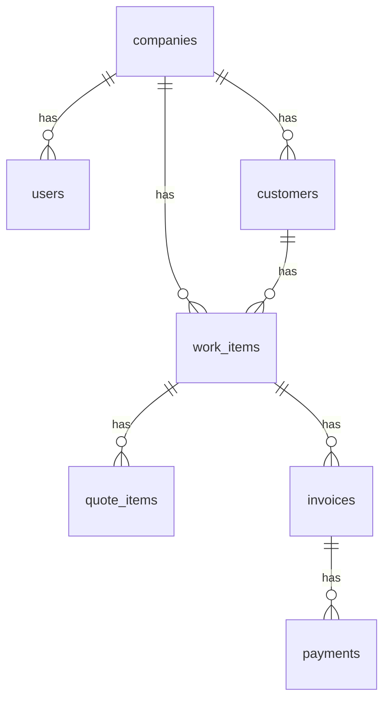

# Data Model

> **Populated in Phase 1.** Placeholder for Phase 0.

## Overview

Canonical schema centered on the unified `work_items` table. See [REBUILD.md § Phase 1](../../REBUILD.md#phase-1--canonical-data-model) for the authoritative table list and rationale.

## ERD

_TBD — Mermaid diagram will be added after `00000000000000_baseline.sql` lands._

## Tables

_TBD — one section per table with columns, indexes, RLS policies._

## RLS Matrix

_TBD — role × table × operation._

## Views

_TBD — `quote_details_view`, `job_schedule_view`, `customer_overview_view`, `analytics_daily_view`, `ai_cost_view`._

## Triggers

_TBD — updated_at, NOTIFY for indexer._
