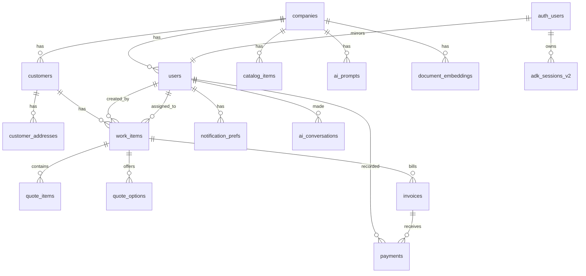

# Data Model

**Baseline migration**: [supabase/migrations/00000000000000_baseline.sql](../../supabase/migrations/00000000000000_baseline.sql)

## Overview

QuotePro 2.0 uses a **single unified table** (`work_items`) to represent leads, quotes, and jobs — one row per business object, lifecycle encoded in `status`. This eliminates the pre-rebuild dual model (`quotes` + `leads` + `jobs` tables side-by-side with a parallel `work_items`) and the type-safety gymnastics it required.

## Entity Relationship Diagram

## Tables

### Multi-tenant root

| Table       | Purpose                                             | Notes                                                        |
| ----------- | --------------------------------------------------- | ------------------------------------------------------------ |
| `companies` | One row per contractor business.                    | `slug` is a generated column derived from name + id fragment |
| `users`     | App-level user record. `id` mirrors `auth.users`.   | Role enum: owner, office, sales, technician                  |

### Customer & catalog

| Table                | Purpose                                       | Notes                                                       |
| -------------------- | --------------------------------------------- | ----------------------------------------------------------- |
| `customers`          | Deduplicated per company by phone or email.   | Partial unique indexes for phone/email                      |
| `customer_addresses` | Multiple addresses per customer.              | Partial unique: only one `is_primary=TRUE` per customer     |
| `catalog_items`      | Product/service catalog with AI metadata.     | `tags TEXT[]` with GIN index; trigram index on `name`       |

### Unified work items

| Table           | Purpose                                                                      | Notes                                                                             |
| --------------- | ---------------------------------------------------------------------------- | --------------------------------------------------------------------------------- |
| `work_items`    | Unified leads / quotes / jobs. `status` encodes lifecycle.                   | `kind` is a GENERATED column derived from status. Public random 128-bit `public_token`. |
| `quote_items`   | Line items for a work_item.                                                 | `total` is GENERATED as `quantity * unit_price`.                                   |
| `quote_options` | Good/Better/Best tiered options.                                            | Unique per `(work_item_id, tier)`.                                                 |

### Billing

| Table      | Purpose                                                             | Notes                                                                |
| ---------- | ------------------------------------------------------------------- | -------------------------------------------------------------------- |
| `invoices` | Invoices from completed jobs.                                       | Includes `stripe_payment_intent_id`, `public_token`, `payment_link_url` |
| `payments` | Multiple payments per invoice (supports partial payments).          | Method enum: cash, check, card, bank_transfer, stripe                |

### AI + audit

| Table                 | Purpose                                                                          | Notes                                                                    |
| --------------------- | -------------------------------------------------------------------------------- | ------------------------------------------------------------------------ |
| `document_embeddings` | pgvector embeddings + BM25 tsvector for hybrid RAG.                              | HNSW index on `embedding`; GIN on `tsv`. Unique per `(company, entity)`. |
| `activity_log`        | Append-only audit trail across all entities.                                     | No UPDATE/DELETE policies                                                |
| `ai_conversations`    | Every LLM call logged with tokens, cost, latency for the `/analytics/ai` view.    | Cost aggregated by `ai_cost_view`.                                       |
| `ai_prompts`          | Per-company prompt overrides.                                                    | Partial unique index enforces one active version per name                |
| `adk_sessions_v2`     | Durable Google ADK session storage (replaces InMemorySessionService).            | Composite PK `(app_name, user_id, session_id)`                           |

### Infrastructure

| Table                 | Purpose                                                                | Notes                                                     |
| --------------------- | ---------------------------------------------------------------------- | --------------------------------------------------------- |
| `notification_prefs`  | User-scoped notification channel + quiet-hours preferences.            | 1:1 with users                                            |
| `webhooks_inbound`    | Idempotent append-only log of external webhook events.                 | Unique `(source, event_id)`; retried by worker            |

## Enums

- `user_role` — owner, office, sales, technician
- `work_item_status` — lead, quote_draft, quote_sent, quote_viewed, quote_accepted, quote_rejected, quote_expired, job_scheduled, job_in_progress, job_completed, job_cancelled, archived
- `invoice_status` — draft, sent, partial, paid, overdue, cancelled
- `payment_method` — cash, check, card, bank_transfer, stripe
- `webhook_status` — pending, processed, failed, skipped

## Views

| View                     | Purpose                                                                                 |
| ------------------------ | --------------------------------------------------------------------------------------- |
| `quote_details_view`     | Work item + customer + JSON aggregated items — hydrates the quote editor & viewer.      |
| `job_schedule_view`      | Scheduled jobs joined with assignee — powers the calendar view.                         |
| `customer_overview_view` | Customer with `quotes_count`, `jobs_count`, `lifetime_paid` for the customer detail page. |
| `analytics_daily_view`   | Per-day leads/quotes/revenue rollup for the analytics dashboard.                        |
| `ai_cost_view`           | Daily $/company/agent for the AI cost dashboard.                                        |

## Key RPC Functions

### `match_documents(query_embedding, query_text, match_company_id, ...)`

Hybrid RAG retrieval:

1. Vector cosine search on `document_embeddings.embedding` (HNSW).
2. BM25 keyword search on `tsvector` (GIN).
3. Merge via **Reciprocal Rank Fusion** with `k=60`.

Returns top-N with `vector_score`, `bm25_score`, `rrf_score`. Used by the `retrieve_catalog_items` and `retrieve_similar_quotes` ADK tools.

### `create_work_item_with_customer(...)`

Atomic customer + address + work_item creation to eliminate the multi-step client-side upsert dance in the pre-rebuild `quotes/new/page.tsx`. Deduplicates customer by phone/email, reuses existing address if identical, sets primary automatically for first address per customer.

### `get_user_company_id() / get_user_role() / is_owner_or_office() / is_owner()`

SECURITY DEFINER helpers used by every RLS policy. Cached in Postgres per statement.

## Triggers

- `set_updated_at()` — timestamps every mutable table.
- `notify_indexer()` — emits `pg_notify('work_item_indexed', ...)` and `pg_notify('catalog_item_indexed', ...)` for the arq indexer worker.
- `handle_new_auth_user()` — on `auth.users` INSERT, creates the mirrored `public.users` row if `raw_user_meta_data.company_id` is set (onboarding sets this).

## RLS Matrix

Legend: **R** = SELECT, **W** = INSERT, **U** = UPDATE, **D** = DELETE, **self** = own record.

| Table                | Owner    | Office   | Sales               | Technician          | service_role |
| -------------------- | -------- | -------- | ------------------- | ------------------- | ------------ |
| companies            | R U      | R U      | R                   | R                   | R W U D      |
| users                | R W U D  | R self-U | R self-U            | R self-U            | R W U D      |
| customers            | R W U D  | R W U    | R W U               | R W U               | R W U D      |
| customer_addresses   | R W U D  | R W U D  | R W U               | R W U               | R W U D      |
| catalog_items        | R W U D  | R W U    | R                   | R                   | R W U D      |
| work_items           | R W U D  | R W U    | R own W U           | R assigned U        | R W U D      |
| quote_items          | R W U D  | R W U D  | R W U               | R W U               | R W U D      |
| invoices             | R W U D  | R W U    | R                   | R                   | R W U D      |
| payments             | R W U    | R W U    | R                   | R                   | R W U D      |
| document_embeddings  | R        | R        | R                   | R                   | R W U D      |
| activity_log         | R W      | R W      | R W                 | R W                 | R W U D      |
| ai_conversations     | R        | R        | R                   | R                   | R W U D      |
| ai_prompts           | R W U    | R W U    | R                   | R                   | R W U D      |
| adk_sessions_v2      | self     | self     | self                | self                | R W U D      |
| notification_prefs   | self     | self     | self                | self                | R W U D      |
| webhooks_inbound     | ✗        | ✗        | ✗                   | ✗                   | R W U D      |

Notes:
- **Sales own W U**: sales role sees/edits work_items where they are `created_by` or `assigned_to`.
- **Technician assigned**: technicians see only work_items where `assigned_to = auth.uid()`.
- **service_role**: bypasses RLS unconditionally for FastAPI backend + webhooks + admin scripts.

## Public token access

`work_items.public_token` and `invoices.public_token` are random 128-bit hex strings used for unauthenticated public URLs (`/q/[token]`, `/i/[token]`). Access happens through server actions that look up by token and enforce read-only semantics — RLS still denies anon `SELECT` on the tables directly.

## Verifying RLS

- `pnpm tsx scripts/verify-rls.ts` — anonymous read test on every public table.
- Manual: query as `authenticated` role with `SET LOCAL request.jwt.claims = '{"sub":"other-user-id"}'` to test cross-tenant isolation.

## Seeded demo data

[supabase/seed.sql](../../supabase/seed.sql) populates:
- 1 company: `Acme HVAC & Plumbing`
- 3 users: `owner@acme.demo`, `office@acme.demo`, `tech@acme.demo` (password `demo1234`)
- 20 customers with primary addresses
- 40 catalog items across HVAC / Plumbing / Labor / Warranty / Electrical
- 15 work_items covering every lifecycle state
- 5 invoices, 3 payments, sample activity + AI conversation rows

